# Flows

How a Transfer actually happens, drawn. Names are the ones in
[`glossary.md`](glossary.md); the reasoning behind the choices is in the ADRs.

Every diagram here is checked against the tests that exercise the same path, so
if one disagrees with the code the code is right and the diagram is a bug.

---

## 1. The two planes

The central fact of the system, and the thing to hold onto before anything else:

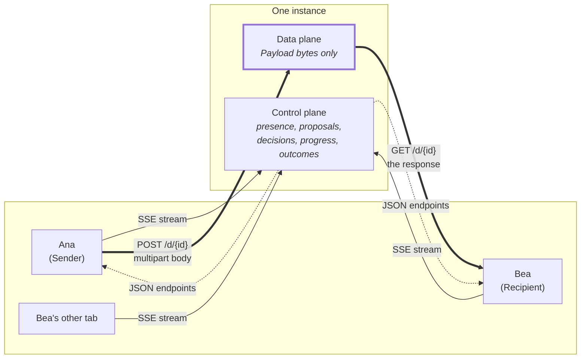

| | Control plane | Data plane |
|---|---|---|
| Carries | presence, proposals, decisions, progress, outcomes | Payload bytes only |
| Transport | one SSE stream per tab, plus small JSON endpoints | one POST body spliced into one in-flight GET response |
| Audience | every interested User, on every tab | exactly the two Users of one Transfer |
| Scales by | **fanout** — every instance hears every event | **affinity** — both halves must meet in one process |

That asymmetry is why everything about a Transfer is answered by one instance and
why events are not (ADR 0001, 0007).

## 2. The states a Transfer passes through

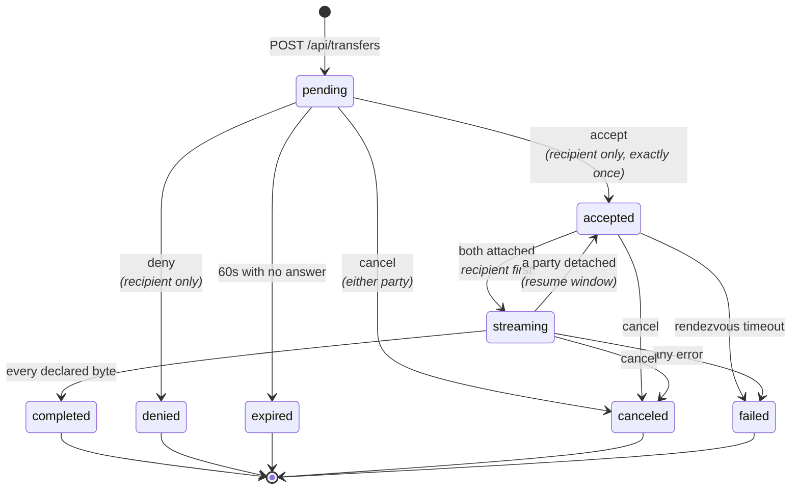

The rules, all enforced in `internal/transfer` without a clock, a mutex or an
HTTP request in sight:

- Only the Recipient may accept or deny; either party may cancel.
- Exactly one accept ever succeeds. `transfer.accepted` carries the winning
  `byStream` so the Recipient's other tabs know to clear their prompt.
- Exactly one Sender and one Recipient may attach — and the Recipient goes first.
- Delivered bytes must equal the declared total, or it is `payload_mismatch`.
- The five terminal states accept nothing further.
- `streaming → accepted` is the resume path: an interrupted party detaches, and
  the reaper enforces the deadline if nobody comes back.

## 3. Signing in and opening a Stream

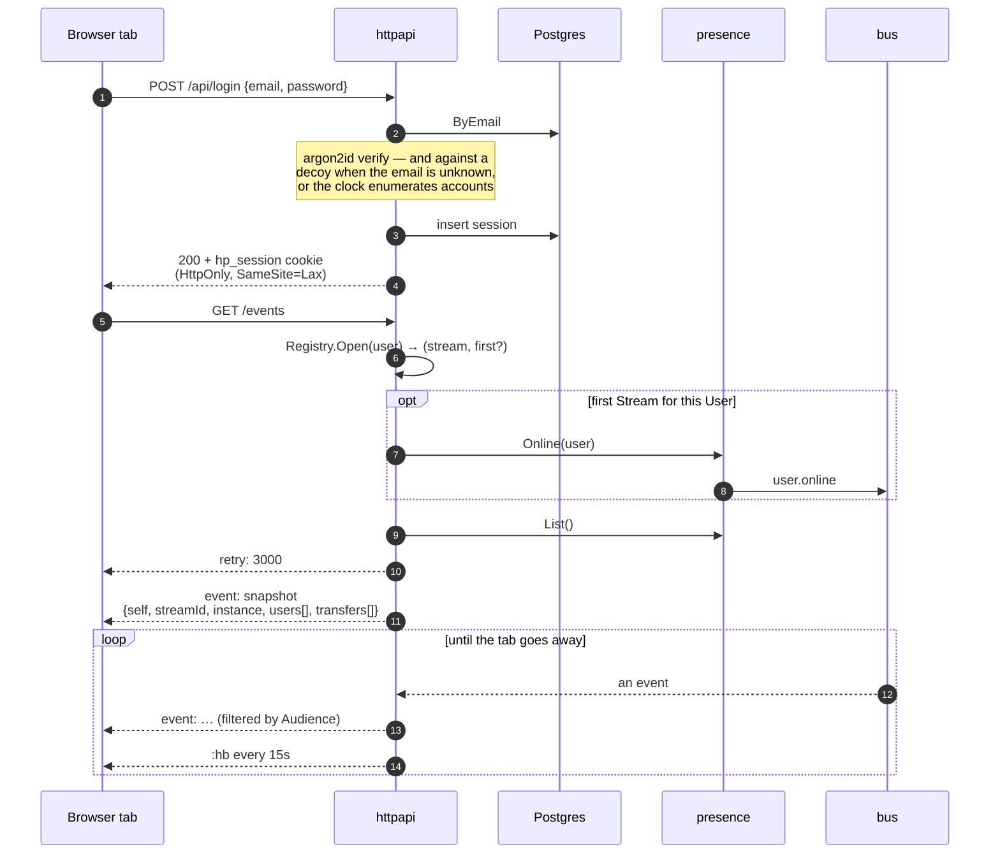

The Snapshot goes first and carries the whole picture, so a client that
reconnects after a blip recovers by being told everything rather than by replaying
what it missed. `Last-Event-ID` is read by nobody (ADR 0003).

## 4. The happy path

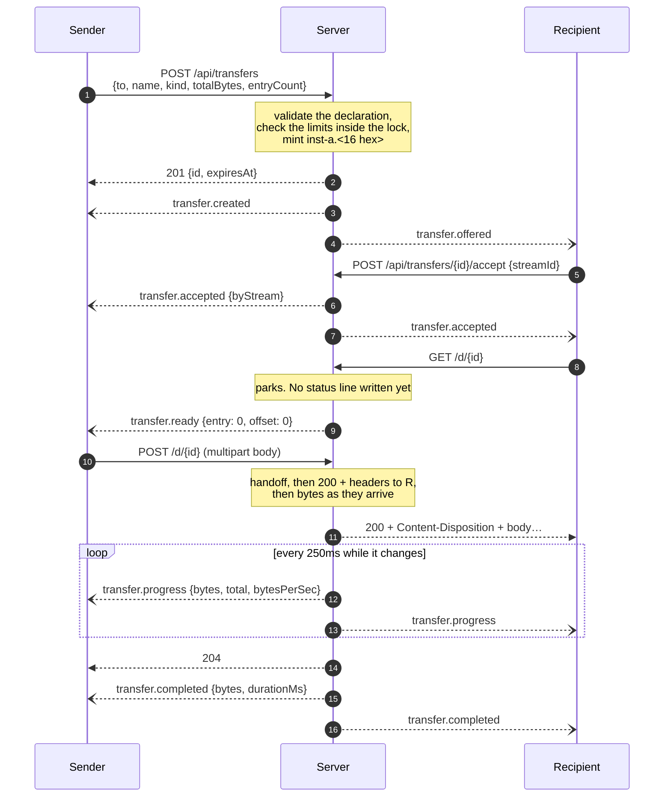

Nothing is read from disk until `transfer.ready` arrives. A POST before that is
`409 recipient_not_attached` — the Sender waits rather than guessing (ADR 0002).

## 5. The rendezvous, and who is blocked on what

The part that is easy to get wrong, so it gets its own diagram:

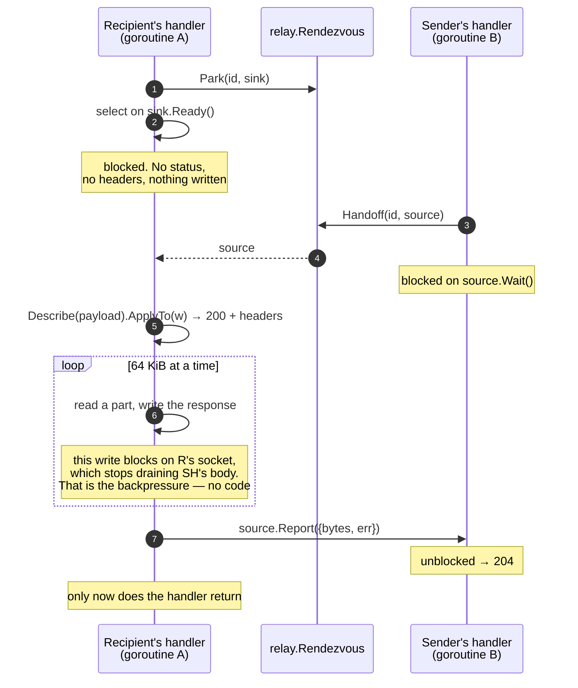

Three things this diagram is the argument for:

- **The copy runs on the Recipient's goroutine.** A `ResponseWriter` is invalid
  the instant its handler returns, so the only way to write a Payload into that
  response is to still be inside that function.
- **The Sender's handler blocks.** If it returned early, its body would be closed
  out from under the copy.
- **Nothing is written before the handoff.** An HTTP status cannot be retracted, so
  committing `200` on arrival would make a no-show unreportable. Parking first is
  what permits a truthful `504`.

## 6. Where the bytes are

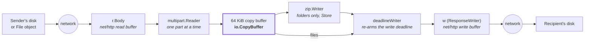

The bold box is the only thing that scales with nothing. Measured: **1 GB
relayed, heap 625 KB → 1.2 MB, 1.4 MB allocated in total**
([`measurements.md`](measurements.md#1-a-gigabyte-through-a-flat-heap)).

A folder is zipped in flight with `Store`: compression would burn CPU per byte on
the one machine here that should stay a dumb pipe, and `archive/zip` can write to
a non-seekable writer because it records each entry's size in a trailing data
descriptor (ADR 0004).

## 7. One event, every instance

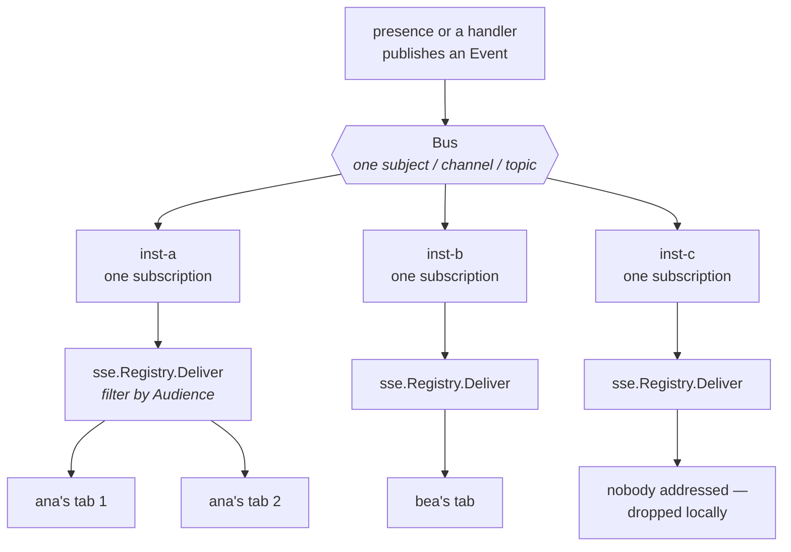

Every instance receives every event and discards what is not for its Users.
Addressing is a *field* on the Event, not a subject, because Kafka has no per-key
subscribe and the swap between four implementations has to stay honest
(ADR 0006). A Stream whose buffer overflows is closed rather than blocking this
fanout; the client reconnects into a fresh Snapshot.

## 8. Two instances, one Transfer

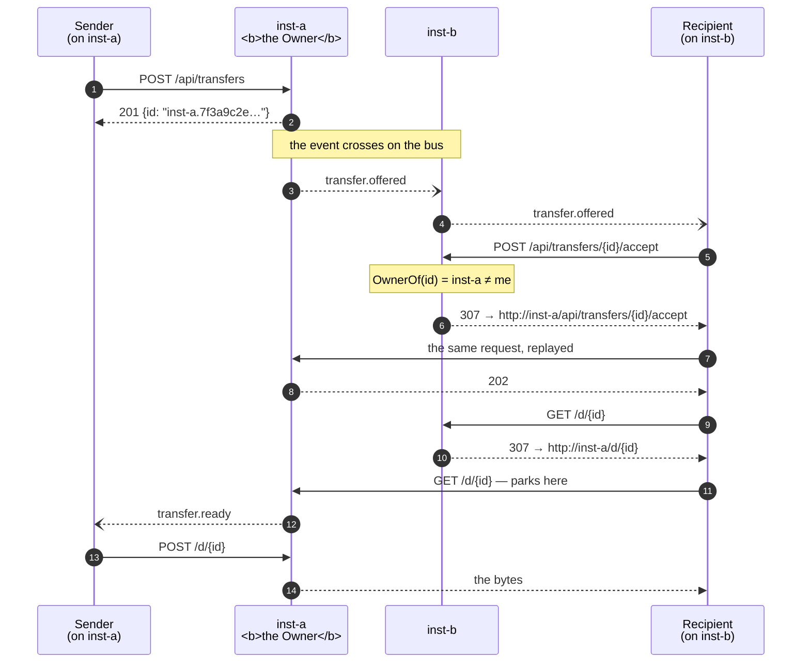

`307`, never `302`: a `302` is allowed to turn a POST into a GET, which would
silently drop an upload's body.

And the trap — a **streaming** upload's `307` is not followed by `net/http`,
because the body cannot be replayed. The client is handed the redirect and has to
repeat the request itself, rebuilding the body from disk. `spud` does exactly
that, and there is a test that fails if it stops.

## 9. Resume — the Sender comes back

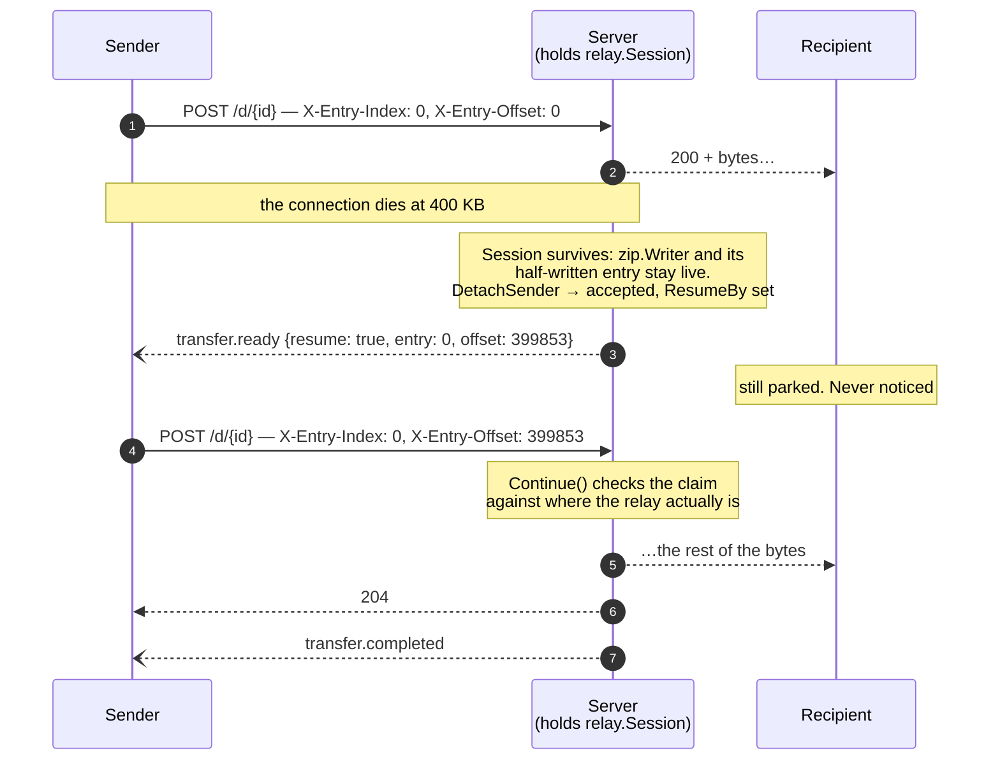

If the Sender claims the wrong place it gets `409` plus `X-Expected-Entry` and
`X-Expected-Offset`. That check is the only defence there is: without a manifest,
a bad offset would splice the wrong bytes in and surface as a CRC error when the
Recipient unzips, far too late to do anything about (ADR 0004, 0008).

The position also travels on the control plane, because a Sender whose upload died
usually never sees its own response — `net/http` reports the broken request body
instead.

## 10. Resume — the Recipient comes back

```mermaid
sequenceDiagram
    autonumber
    participant S as Sender
    participant Srv as Server
    participant R as Recipient

    S->>Srv: POST /d/{id}
    Srv-->>R: 200 + bytes…
    Note over Srv,R: the Recipient's socket dies.<br/>293 KB is on its disk;<br/>the Owner had written 300 KB
    Note over Srv: DetachRecipient → accepted, ResumeBy set
    Srv-->>S: 502 + X-Expected-*

    R->>Srv: GET /d/{id} — Range: bytes=300000-
    Note over Srv: SkipTo(300000) rewinds what<br/>the Sender is expected to send
    Srv-->>R: 206 + Content-Range: bytes 300000-899999/900000
    Srv--)S: transfer.ready {entry: 0, offset: 300000}
    S->>Srv: POST /d/{id} — X-Entry-Offset: 300000
    Srv-->>R: the tail
    Srv--)S: transfer.completed
```

`N` comes from the **Recipient**, and it has to. The Owner counts bytes it wrote
*into a socket*, which after a disconnection exceeds what came out of the other
end by whatever was in flight — about 98 KB on loopback. Only the Recipient knows
what it holds, which is why every resumable download protocol works this way
round.

A folder cannot be resumed into a new response: the archive was being built as it
streamed, and that stream went with the socket. The server answers `416`, and it
answers it *before* attaching — an earlier version checked the Range afterwards
and a rejected request burnt the Recipient's one attach.

## 11. When it goes wrong

Every failure produces a precise, addressed event. No connection is ever left
hanging without an explanation.

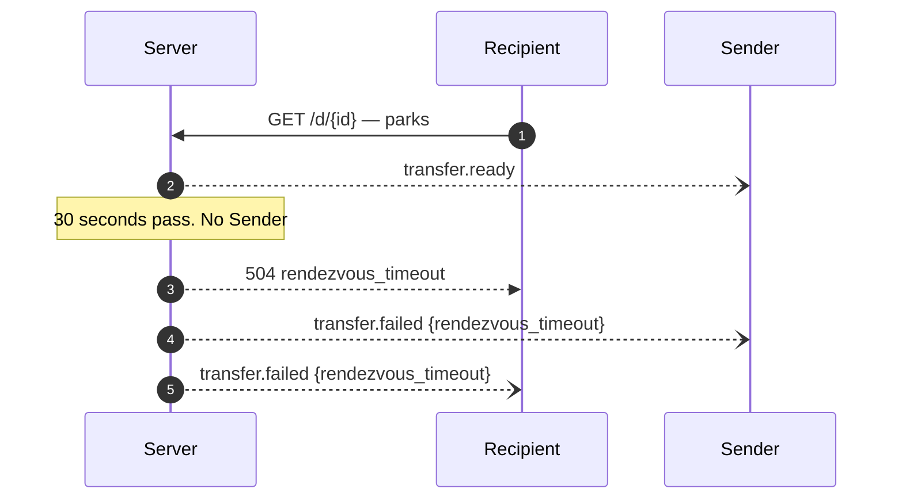

That `504` is only possible because no status was written when the Recipient
arrived.

| What happened | Detected by | Reason | Status |
|---|---|---|---|
| Sender never arrives | the rendezvous timer | `rendezvous_timeout` | `504` to the Recipient |
| Sender dies mid-stream | a read error on its body | `sender_disconnected` | truncated body |
| Recipient dies mid-stream | a write error on its socket | `recipient_disconnected` | `502` to the Sender |
| Bytes ≠ declared total | `Complete` | `payload_mismatch` | `502` to the Sender |
| Offer unanswered for 60s | the reaper | `offer_expired` | — |
| Interrupted, nobody returns | the reaper, on `ResumeBy` | `sender_disconnected` | — |
| Either party cancels | the cancel endpoint | — | `transfer.canceled`, and the relay is abandoned at the next 64 KiB boundary |
| Instance draining | the drain hook | `instance_draining` | `503` to new requests |

Which *side* of the copy failed is tracked separately, because that is what
decides who gets blamed. `io.ErrShortWrite` counts as a write failure however it
presents itself: only a destination can short-write.

## 12. Shutting down

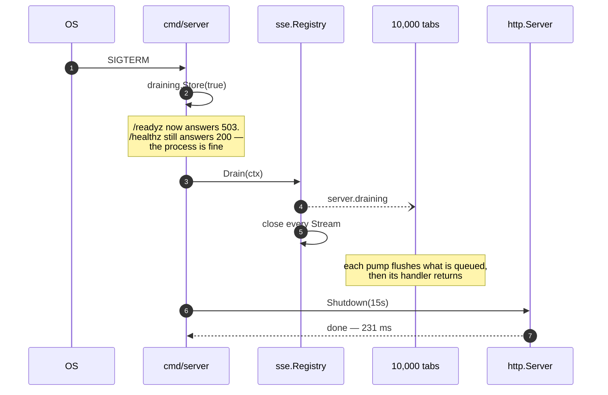

The order is the whole point. `Server.Shutdown` waits for open connections and an
SSE handler never returns on its own, so a drain hook added *after* the streams
exist means rediscovering Go issue #41344 the hard way. It has been in this
codebase since phase 0, when it was a no-op.

Measured: **231 ms with ten thousand open Streams**
([`load-test.md`](load-test.md#shutting-down-with-all-of-them-open)).

---

## Reading the code along the diagrams

| Flow | Start here |
|---|---|
| Sign in, sessions | `internal/auth/auth.go`, `internal/auth/middleware.go` |
| Opening a Stream, the Snapshot | `internal/httpapi/events.go`, `internal/sse/stream.go` |
| Offer, accept, deny, the reaper | `internal/httpapi/transfers.go` |
| The rendezvous and the relay | `internal/httpapi/data.go`, `internal/relay/rendezvous.go` |
| The byte path | `internal/relay/copy.go` |
| Resume | `internal/relay/resume.go`, `cmd/spud/resume.go` |
| Event fanout | `internal/bus/`, `internal/sse/registry.go` |
| Ownership | `internal/httpapi/ownership.go`, `internal/mirror/instances.go` |
| Drain | `cmd/server/main.go`, `internal/sse/registry.go` |
